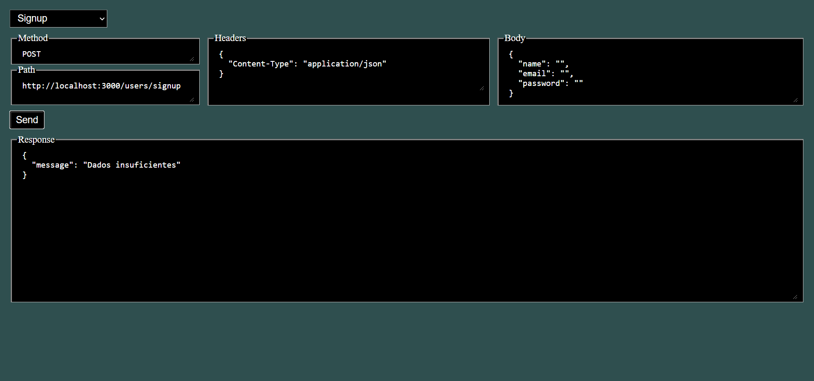

# FutureBook



## Stack

* Express
* MySql
* Knex
* Uuid
* Bcrypt
* JsonWebToken
* Dotenv
* Cors

## Running the project

1. Clone this repository into your machine
1. Open your preferred CLI inside the cloned repo and run the following commands:
    * `npm install` 
    * `touch .env`
    * `start .env`
1. Paste the following environment variables into your **.env** file, replacing their values for those of your own SQL database:

   ```DB_HOST = myhost.com
      DB_USER = me
      DB_PASSWORD = xxxxxxxxxxxxxxxxxxxx
      DB_NAME = mytable      
      JWT_KEY = xxxxxxxxxxxx
   ```

1. Run the following queries on your SQL database:
   
   ```SQL
   CREATE TABLE future_book_users (
       id VARCHAR(255) PRIMARY KEY,
       name VARCHAR(255) UNIQUE NOT NULL,
       email VARCHAR(255) UNIQUE NOT NULL,
       password VARCHAR(255) UNIQUE
   );
   ```
   
   ```SQL
   CREATE TABLE future_book_friends (
       user_id VARCHAR(255),
       friend_id VARCHAR(255),
       PRIMARY KEY (user_id , friend_id),
       FOREIGN KEY (user_id) REFERENCES future_book_users (id),
       FOREIGN KEY (friend_id) REFERENCES future_book_users (id)
   );
   ```
   
   ```SQL
   CREATE TABLE future_book_posts (
       id VARCHAR(255) PRIMARY KEY,
       author_id VARCHAR(255),
       description VARCHAR(255),
       creation_date DATETIME,
       type VARCHAR(255),
       img VARCHAR(255),
       FOREIGN KEY (author_id) REFERENCES future_book_users (id)
   );
   ```
   
   ```SQL
   CREATE TABLE future_book_likes (
       friend_id VARCHAR(255),
       post_id VARCHAR(255),
       PRIMARY KEY (friend_id , post_id),
       FOREIGN KEY (friend_id) REFERENCES future_book_users (id),
       FOREIGN KEY (post_id) REFERENCES future_book_posts (id)
   );
   ```
1. Run `npm run start` on your CLI
1. Open your browser's *localhost* and test de endpoints using the project's own GUI. Alternatively, you can use other softwares such as Postman.


